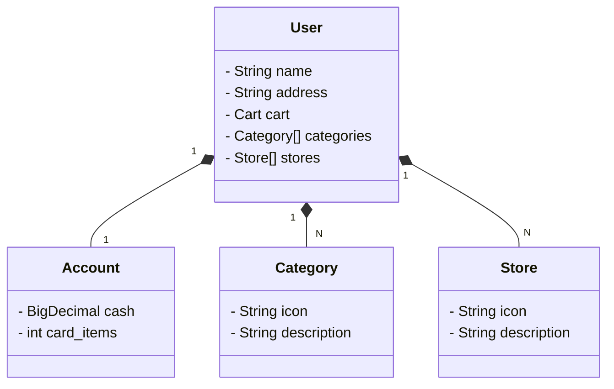

#Projeto Para bootcamp

```mermaid
classDiagram
    class User {
        - String name
        - String address
        - Cart cart
        - Category[] categories
        - Store[] stores
    }

    class Account {
        - BigDecimal cash
        - int card_items
    }

    class Category {
        - String icon
        - String description
    }


    class Store {
        - String icon
        - String description
    }

    User "1" *-- "1" Account
    User "1" *-- "N" Category 
    User "1" *-- "N" Store 
```
